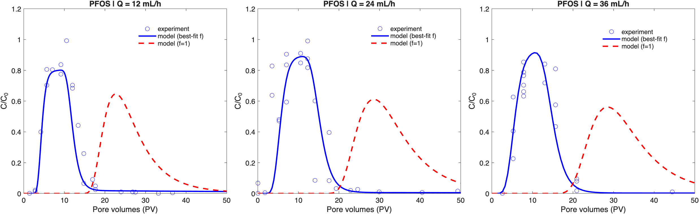

# PFAS transport in CAC-amended groundwater barriers

This repository contains MATLAB codes used to simulate PFAS transport in
colloidal activated carbon (CAC)–amended sand columns, with a focus on
particle-scale mass-transfer limitations and non-equilibrium sorption.

The model solves a one-dimensional advection–dispersion equation with
nonlinear Freundlich sorption and a two-site formulation that accounts for
both equilibrium and kinetic sorption domains. The codes provided here
support the analyses and figures presented in a manuscript submitted to
*ACS ES&T Engineering*.

---

## Associated publication

Zheng, Z., Cline, D., Shih, C.-Y., Richardson, S. D., Newell, C.,
El Mohtar, C., Hesse, M. A., Werth, C. J.
**Effects of Mass-transfer Limitations on PFAS Breakthrough in
Colloidal Activated Carbon Groundwater Barriers**.
*ACS ES&T Engineering* (submitted).

---

## Authors

- Zijie Zheng (zhengzj@utexas.edu)
- Dayna Cline
- Chun-Yu Shih
- Stephen D. Richardson
- Charles Newell
- Chadi El Mohtar
- Marc A. Hesse (mhesse@jsg.utexas.edu)
- Charles J. Werth (werth@utexas.edu)

---

## Corresponding author affiliations (Email provided)

Corresponding authors:  
Zijie Zheng; Charles J. Werth; Marc A. Hesse

Department of Civil, Architectural and Environmental Engineering  
The University of Texas at Austin

Oden Institute for Computational Engineering and Sciences /  
Jackson School of Geosciences /  
University of Texas Institute for Geophysics  
The University of Texas at Austin

---

## 4-line Summary

The codes simulate PFAS transport in colloidal activated carbon (CAC)–amended
sand columns using a one-dimensional advection–dispersion model with nonlinear
Freundlich sorption and a two-site (equilibrium + kinetic) formulation.
The model reproduces non-ideal breakthrough behavior observed in column
experiments and supports the analyses presented in the associated manuscript.



*Experimental PFOS breakthrough data (symbols) and model simulations using a
two-site sorption formulation with best-fit equilibrium fraction (solid lines)
and a fully equilibrium model (dashed lines).*

---
## Citation

If you use this code, please cite the associated manuscript:

Zheng, Z.; Cline, D.; Shih, C.-Y.; Richardson, S. D.; Newell, C.;
El Mohtar, C.; Hesse, M. A.; Werth, C. J.
*Effects of Mass-transfer Limitations on PFAS Breakthrough in
Colloidal Activated Carbon Groundwater Barriers*.
ACS ES&T Engineering (submitted).

---
## Getting Started

### Requirements
- MATLAB R2020b or later

No additional toolboxes are required beyond standard MATLAB functionality.


### Quick usage

After downloading or cloning the repository, open MATLAB, navigate to the
repository root directory, and run:

```matlab
run(fullfile('src','Run_PFOS_column.m'))


